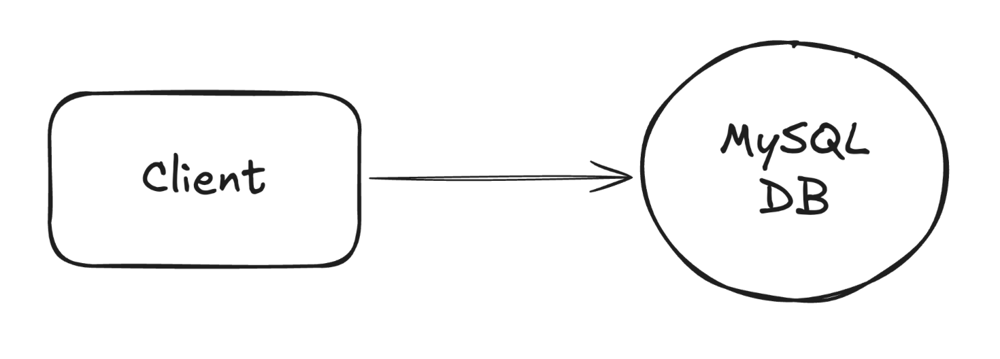

# 📺 Ticketmaster – Section 1

Welcome! This section contains the setup instructions and demo walkthrough for building the initial foundation of the Ticketmaster project — including setting up the **MySQL database** and creating the initial `Tickets` and `Events` table.

<div align="center">
    
</div>

## 🎥 Video Walkthrough

**Title:** Ticketmaster – Section 1  
**Link:** [Watch on Udemy](https://www.udemy.com/course/practical-system-design/learn/lecture/55998743#overview)

# ⚙️ Instructions and Commands

### 1. Create the Project Directory

Create the base project folder:

```bash
mkdir -p ~/Desktop/ticketmaster_demo
```

Open the folder in VS Code:

```bash
code -r ~/Desktop/ticketmaster_demo
```

&nbsp;&nbsp;&nbsp;&nbsp; _Alternatively, you can also drag the `ticketmaster_demo` folder directly into VS Code._

### 2. Configure Environment Variables

Create the Environment File:

```bash
touch .ticketmaster_env
```

-  On **Windows PowerShell**:
  ```bash
  New-Item .ticketmaster_env.ps1
  ```

> _Paste in the provided environment variable file starter code._

Load the environment variables into your current shell session:

```bash
source .ticketmaster_env
```

-  On **Windows PowerShell**:
  ```bash
  . .\.ticketmaster_env.ps1
  ```

Confirm that the variables were loaded successfully:

```bash
echo $TICKETMASTER_DB_URL
```

### 3. Connect to MySQL & Select Database

Use a temporary MySQL client container to connect to your database:

```bash
docker run --rm -it \
  -e MYSQL_PWD='Password100!' \
  mysql:8.0 \
  mysql -h $TICKETMASTER_DB_URL -u admin
```

-  On **Windows PowerShell**:
  ```bash
  docker run --rm -it `
    -e MYSQL_PWD='Password100!' `
    mysql:8.0 `
    mysql -h $TICKETMASTER_DB_URL -u admin
  ```

Once connected, switch to the `ticketmaster_db` database:

```bash
USE ticketmaster_db;
```

### 4. Create `Events` Table & Seed Sample Data

Create the `Events` table:

```sql
CREATE TABLE Events (
    eventId VARCHAR(255) NOT NULL PRIMARY KEY,      -- Unique event identifier
    name VARCHAR(255),                              -- Event name
    description TEXT,                               -- Event description
    date DATETIME,                                  -- Scheduled date and time
    createdAt DATETIME DEFAULT CURRENT_TIMESTAMP    -- Record creation timestamp
);
```

Seed sample records:

```sql
INSERT INTO Events (eventId, name, description, date, createdAt)
VALUES
    ('1H', 'Taylor Swift Concert', 'An electrifying concert featuring Taylor Swift.', '2030-03-15 19:00:00', NOW()),
    ('2L', 'Classical Music Concert', 'A soothing evening of classical music.', '2030-04-20 18:30:00', NOW()),
    ('3L', 'Stand-up Comedy', 'An evening of laughs with top comedians.', '2030-05-10 20:00:00', NOW());
```

> 💡 **Note**: The `eventId` suffix indicates expected traffic:
>
> - `H` → "High-traffic event"
> - `L` → "Low-traffic event"

Confirm that the records were inserted successfully:

```sql
SELECT * FROM Events;
```

### 5. Create `Tickets` Table & Seed Sample Data

Create the `Tickets` table:

```sql
CREATE TABLE Tickets (
    ticketId VARCHAR(255) NOT NULL PRIMARY KEY,      -- Format: <seatNumber>:<eventId>
    eventId VARCHAR(255) NOT NULL,                   -- Foreign key to Events
    userId VARCHAR(255),                             -- Nullable user ID
    seatNumber INT,                                  -- Seat number
    price NUMERIC(10, 2),                            -- Ticket price
    isBooked BOOLEAN DEFAULT FALSE,                  -- Booking status
    createdAt DATETIME DEFAULT CURRENT_TIMESTAMP,    -- Timestamp

    CONSTRAINT fk_ticket_event
    FOREIGN KEY (eventId)
    REFERENCES Events(eventId)
    ON DELETE CASCADE
);
```

Seed sample records:

```sql
INSERT INTO Tickets (ticketId, eventId, userId, seatNumber, price, isBooked, createdAt)
VALUES
    -- Event 1: Taylor Swift (eventId = 1H)
    ('1:1H', '1H', NULL, 1, 99.99, FALSE, NOW()),
    ('2:1H', '1H', NULL, 2, 99.99, FALSE, NOW()),
    ('3:1H', '1H', NULL, 3, 99.99, FALSE, NOW()),

    -- Event 2: Classical Music (eventId = 2L)
    ('1:2L', '2L', NULL, 1, 149.50, FALSE, NOW()),
    ('2:2L', '2L', 'user_1', 2, 149.50, TRUE, NOW()),
    ('3:2L', '2L', 'user_2', 3, 149.50, TRUE, NOW()),

    -- Event 3: Comedy (eventId = 3L)
    ('1:3L', '3L', NULL, 1, 75.00, FALSE, NOW()),
    ('2:3L', '3L', 'user_3', 2, 75.00, TRUE, NOW()),
    ('3:3L', '3L', NULL, 3, 75.00, FALSE, NOW());
```

> 💡 **Note**: The `ticketId` format (`<seatNumber>:<eventId>`) improves traceability and simplifies downstream integrations.

Confirm that the records were inserted successfully:

```sql
SELECT * FROM Tickets;
```

### 6. Exit MySQL Session

```bash
exit
```

<br>
