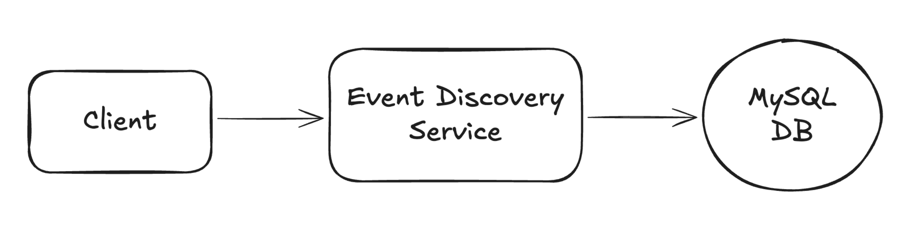

# 📺 Ticketmaster – Section 2

In this section, we begin building the **Event Discovery Service** using AWS Lambda. This service will handle read-only GET requests to fetch event and ticket data.

<div align="center">
    
</div>

## 🎥 Video Walkthrough

**Title:** Ticketmaster – Section 2  
**Link:** [Watch on Udemy](https://www.udemy.com/course/practical-system-design/learn/lecture/55998749#overview)

# ⚙️ Instructions and Commands

From project root `~Desktop/ticketmaster_demo`:

### 1. Create Event Discovery Service

Create a new folder for the service:

```bash
mkdir event_discovery_service
```

Create the Lambda handler file inside the directory:

```bash
touch event_discovery_service/lambda_function.py
```

-  On **Windows PowerShell**:
  ```bash
  New-Item event_discovery_service/lambda_function.py
  ```

> _Paste in the provided starter code for the Lambda function._

### 2. Set Up Virtual Environment and Install Dependencies

Create virtual environment:

```bash
python3 -m venv ticketmaster_venv
```

- Alternatively (on some systems):
  ```bash
  python -m venv ticketmaster_venv
  ```

Activate virtual environment:

```bash
source ticketmaster_venv/bin/activate
```

-  On **Windows PowerShell**:

  ```bash
  .\ticketmaster_venv\Scripts\Activate.ps1
  ```

- 💬 **Note**: If activation fails, you may need to allow script execution first:
  ```bash
  Set-ExecutionPolicy -Scope CurrentUser -ExecutionPolicy RemoteSigned -Force
  ```

Install dependencies:

```bash
pip install pymysql
```

### 3. Run Lambda Function Locally

```bash
python event_discovery_service/lambda_function.py
```

<br>
