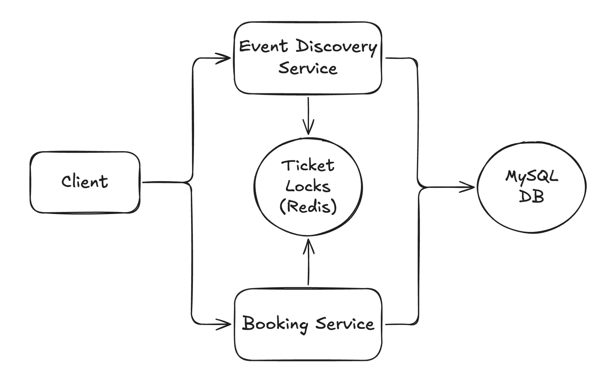

# 📺 Ticketmaster – Section 3

In this section, we implement **Phase 1 of the Booking Service** — the reservation endpoint that enables users to temporarily lock a ticket before completing their booking.
This logic is essential for preventing race conditions in high-traffic scenarios where multiple users might attempt to reserve the same seat simultaneously.

<div align="center">
    
</div>

## 🎥 Video Walkthrough

**Title:** Ticketmaster – Section 3  
**Link:** [Watch on Udemy](https://www.udemy.com/course/practical-system-design/learn/lecture/55998757#overview)

# ⚙️ Instructions and Commands

From project root `~Desktop/ticketmaster_demo`:

### 1. Load Environment Variables

From the root directory of the project, load the environment variables into your current terminal session:

```bash
source .ticketmaster_env
```

-  On **Windows PowerShell**:
  ```bash
  . .\.ticketmaster_env.ps1
  ```

### 2. Prepare `redis-cli`

For **macOS** users, install `redis-cli` locally using Homebrew:

```bash
brew install redis
```

> For **Windows** users, we’ll use `redis-cli` via Docker, so no additional installation is required.

### 3. Connect to Redis

```bash
redis-cli -u $TICKETMASTER_REDIS_URL
```

-  On **Windows PowerShell**:
  ```bash
  docker run -it --rm redis redis-cli -u $TICKETMASTER_REDIS_URL
  ```

### 4. Redis CLI Locking Demo

Run the following commands inside the Redis CLI to simulate a reservation lock:

- Verify initial state
  ```bash
  keys *
  ```
- Create a reservation lock for `user_1` with a 60-second expiration
  ```bash
  SET reserved:1:1H_99.99 user_1 EX 60 NX
  ```
- Before the 60-second TTL expires, attempt to acquire the same lock for `user_2`
  ```bash
  SET reserved:1:1H_99.99 user_2 EX 60 NX
  ```
- Inspect lock state before the 60-second TTL expires
  ```bash
  keys *
  GET reserved:1:1H_99.99
  TTL reserved:1:1H_99.99
  ```
- After the 60-second TTL expires, confirm the lock has been released
  ```bash
  keys *
  ```

### 5. Create Booking Reserve Service

Create a new folder for the service:

```bash
mkdir booking_reserve_service
```

Create the Lambda handler file inside the directory:

```bash
touch booking_reserve_service/lambda_function.py
```

-  On **Windows PowerShell**:
  ```bash
  New-Item booking_reserve_service/lambda_function.py
  ```

> _Paste in the provided starter code for the Lambda function._

### 6. Virtual Environment Updates

Make sure your virtual environment is activated:

```bash
source ticketmaster_venv/bin/activate
```

-  On **Windows PowerShell**:
  ```bash
  .\ticketmaster_venv\Scripts\Activate.ps1
  ```

Install `redis` library into your virtual environment:

```bash
pip install redis
```

### 7. Run Booking Reserve Service Locally

Execute the booking reserve service:

```bash
python booking_reserve_service/lambda_function.py
```

In the Redis CLI, verify that the reservation lock was created:

```bash
keys *
GET reserved:1:1H_99.99
TTL reserved:1:1H_99.99
```

Before the TTL expires, execute the service again:

```bash
python booking_reserve_service/lambda_function.py
```

### 8. Test End-to-End Flow Locally

If the TTL has expired, run the booking reserve service again to recreate the lock:

```bash
python booking_reserve_service/lambda_function.py
```

Execute the event discovery service:

```bash
python event_discovery_service/lambda_function.py
```

<br>
