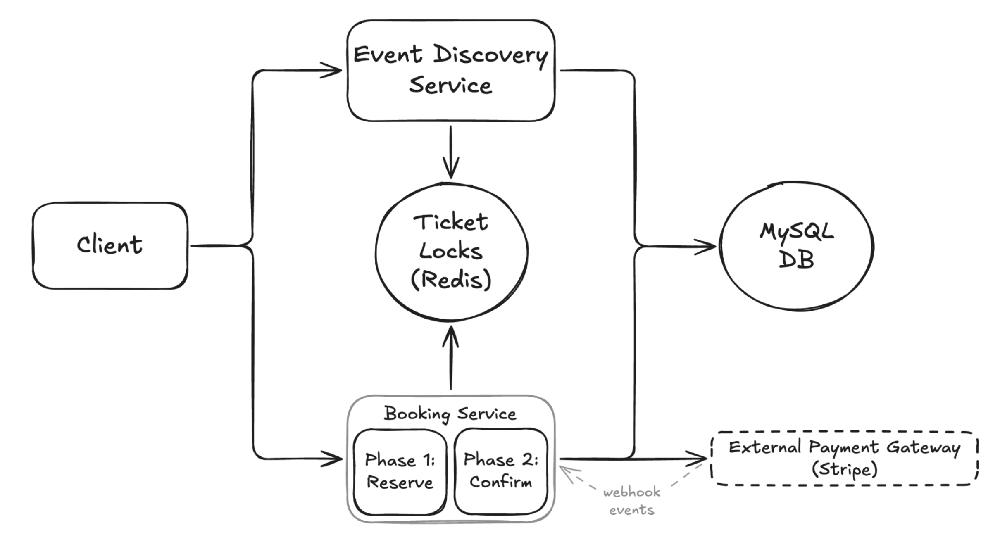

# 📺 Ticketmaster – Section 4

In this section, we implement **Phase 2 of the Booking Service**, which finalizes a ticket reservation by confirming payment and updating system state.

<div align="center">
    
</div>

## 🎥 Video Walkthrough

**Title:** Ticketmaster – Section 4  
**Link:** [Watch on Udemy](https://www.udemy.com/course/practical-system-design/learn/lecture/55998761#overview)

# ⚙️ Instructions and Commands

From project root `~Desktop/ticketmaster_demo`:

### 1. Create Stripe Test Script

Create a new folder for the booking confirm service:

```bash
mkdir booking_confirm_service
```

Create the test script file inside the directory:

```bash
touch booking_confirm_service/stripe_test_script.py
```

-  On **Windows PowerShell**:
  ```bash
  New-Item booking_confirm_service/stripe_test_script.py
  ```

> _Paste in the provided starter code for the test script._

### 2. Virtual Environment Updates

Make sure your virtual environment is activated:

```bash
source ticketmaster_venv/bin/activate
```

-  On **Windows PowerShell**:
  ```bash
  .\ticketmaster_venv\Scripts\Activate.ps1
  ```

Install `stripe` SDK into your virtual environment:

```bash
pip install stripe
```

### 3. Run Stripe Test Script Locally

```bash
python booking_confirm_service/stripe_test_script.py
```

### 4. Create Booking Confirm Service

```bash
touch booking_confirm_service/lambda_function.py
```

-  On **Windows PowerShell**:
  ```bash
  New-Item booking_confirm_service/lambda_function.py
  ```

> _Paste in the provided starter code for the Lambda function._

### 5. Test End-to-End Booking Flow Locally

Connect to Redis:

```bash
redis-cli -u $TICKETMASTER_REDIS_URL
```

-  On **Windows PowerShell**:
  ```bash
  docker run -it --rm redis redis-cli -u $TICKETMASTER_REDIS_URL
  ```

Inside the Redis CLI, confirm there are no existing reservation locks:

```bash
keys *
```

Run the **booking confirm service (Phase 2)** without creating a reservation first:

```bash
python booking_confirm_service/lambda_function.py
```

> Expected result: `410` — _Ticket lock missing or expired_

Run the **booking reserve service (Phase 1)** to create a temporary reservation:

```bash
python booking_reserve_service/lambda_function.py
```

Back in the Redis CLI, confirm the lock was created:

```bash
keys *
GET reserved:1:1H_99.99
```

Now that the reservation exists, run the **booking confirm service (Phase 2)** again:

```bash
python booking_confirm_service/lambda_function.py
```

> Expected result: `200` — _Booking confirmed_

Back in the Redis CLI, ensure the reservation lock has been removed:

```bash
keys *
```

Exit the Redis CLI:

```bash
Ctrl + C
```

### 6. Database Verification & Reset

Use a temporary MySQL client container to connect to your database:

```bash
docker run --rm -it \
  -e MYSQL_PWD='Password100!' \
  mysql:8.0 \
  mysql -h $TICKETMASTER_DB_URL -u admin
```

-  On **Windows PowerShell**:
  ```bash
  docker run --rm -it `
    -e MYSQL_PWD='Password100!' `
    mysql:8.0 `
    mysql -h $TICKETMASTER_DB_URL -u admin
  ```

Once connected, switch to the `ticketmaster_db` database:

```bash
USE ticketmaster_db;
```

Verify the current state of all tickets:

```sql
SELECT * FROM Tickets;
```

> You should see the ticket `1:1H` marked as booked after a successful confirmation.

Reset ticket to unbooked state:

```sql
UPDATE Tickets SET userId = NULL, isBooked = 0 WHERE ticketId = '1:1H';
```

<br>
