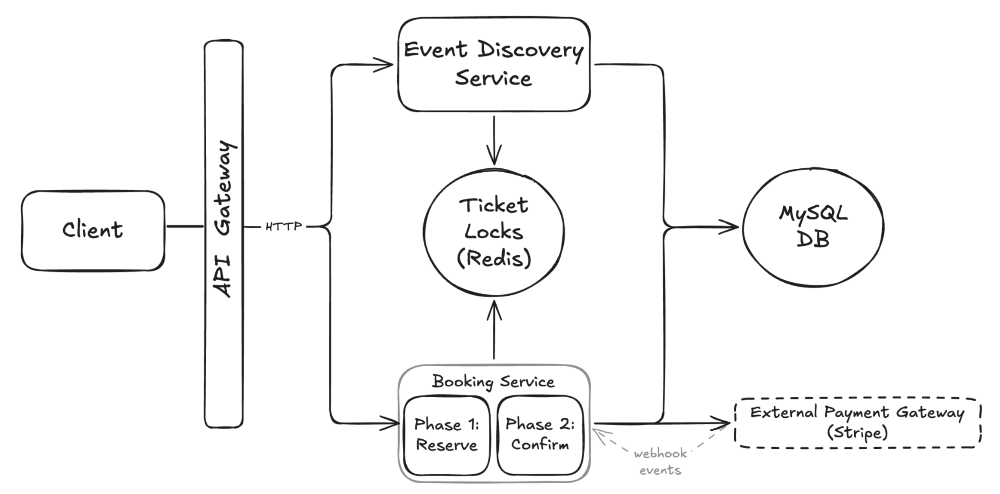

# 📺 Ticketmaster – Section 5

In this section, we integrate all existing Lambda services with **API Gateway** and enable end-to-end testing via browser and cURL. We also refactor our Lambda functions to return simple frontend HTML to make the booking flow easier to visualize and understand during testing.

<div align="center">
    
</div>

## 🎥 Video Walkthrough

**Title:** Ticketmaster – Section 5  
**Link:** [Watch on Udemy](https://www.udemy.com/course/practical-system-design/learn/lecture/55998769#overview)

# ⚙️ Instructions and Commands

From project root `~Desktop/ticketmaster_demo`:

### 1. Package Services for Deployment

Make sure your virtual environment is activated:

```bash
source ticketmaster_venv/bin/activate
```

-  On **Windows PowerShell**:
  ```bash
  .\ticketmaster_venv\Scripts\Activate.ps1
  ```

Package the **Event Discovery Service** for deployment:

- Navigate into the service directory
  ```bash
  cd event_discovery_service
  ```
- Install dependencies into the local directory
  ```bash
  pip install pymysql redis -t .
  ```
- Create the deployment package

  ```bash
  zip -r lambda_function.zip .
  ```

  -  On **Windows PowerShell**:
    ```bash
    tar -a -c -f lambda_function.zip *
    ```

Package the **Booking Reserve Service** for deployment:

- Navigate into the service directory
  ```bash
  cd ../booking_reserve_service
  ```
- Install dependencies into the local directory
  ```bash
  pip install pymysql redis -t .
  ```
- Create the deployment package

  ```bash
  zip -r lambda_function.zip .
  ```

  -  On **Windows PowerShell**:
    ```bash
    tar -a -c -f lambda_function.zip *
    ```

Package the **Booking Confirm Service** for deployment:

- Navigate into the service directory
  ```bash
  cd ../booking_confirm_service
  ```
- Install dependencies into the local directory
  ```bash
  pip install pymysql redis stripe -t .
  ```
- Create the deployment package

  ```bash
  zip -r lambda_function.zip .
  ```

  -  On **Windows PowerShell**:
    ```bash
    Get-ChildItem -Force -Exclude lambda_function.zip | ForEach-Object { $_.Name } | tar -a -c -f lambda_function.zip -T -
    ```
    > ⚠️ _We use this slightly more defensive version of the `tar` command because the `booking_confirm_service` includes a larger set of dependencies (such as `stripe`)._  
    > &nbsp;&nbsp;&nbsp;&nbsp;_In some cases, the simpler wildcard version can fail on Windows when packaging larger dependency folders._

### 2. Database Verification & Reset

Use a temporary MySQL client container to connect to your database:

```bash
docker run --rm -it \
  -e MYSQL_PWD='Password100!' \
  mysql:8.0 \
  mysql -h $TICKETMASTER_DB_URL -u admin
```

-  On **Windows PowerShell**:
  ```bash
  docker run --rm -it `
    -e MYSQL_PWD='Password100!' `
    mysql:8.0 `
    mysql -h $TICKETMASTER_DB_URL -u admin
  ```

Once connected, switch to the `ticketmaster_db` database:

```bash
USE ticketmaster_db;
```

Verify the current state of all tickets:

```sql
SELECT * FROM Tickets;
```

> You should see the ticket `1:1H` marked as booked after a successful confirmation.

Reset ticket to unbooked state:

```sql
UPDATE Tickets SET userId = NULL, isBooked = 0 WHERE ticketId = '1:1H';
```

<br>
