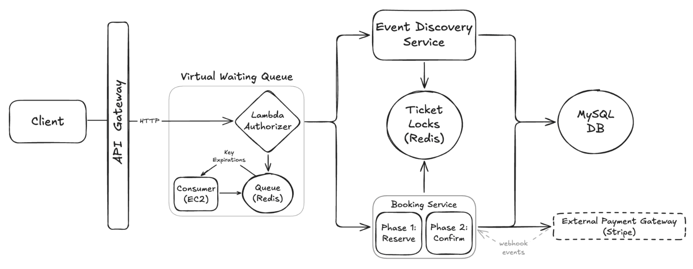

# 📺 Ticketmaster – Section 6

In this section, we implement a **Virtual Waiting Queue** using a **Lambda Authorizer** and **Redis** to control access to high-traffic events. A background **EC2 Consumer** advances users in the queue, enabling fair, rate-limited access across all event and booking routes.

- **Part 1 — Build and Test the Queue Locally**:  
  We create the Virtual Waiting Queue Lambda Authorizer, implement the Redis queue logic, and run full end-to-end tests locally with multiple users entering and advancing through the line.

- **Part 2 — Deploy to AWS**:  
  We package and deploy the Lambda Authorizer, launch the background queue consumer on EC2 with User Data, and verify the full cloud-based waiting queue flow.

<div align="center">
    
</div>

## 🎥 Video Walkthrough

### 🔹 Part 1: Build and Test the Queue Locally

**Title:** Ticketmaster – Section 6 (Part 1)  
**Link:** [Watch on Udemy](https://www.udemy.com/course/practical-system-design/learn/lecture/55998775#overview)

### 🔹 Part 2: Deploy to AWS

**Title:** Ticketmaster – Section 6 (Part 2)  
**Link:** [Watch on Udemy](https://www.udemy.com/course/practical-system-design/learn/lecture/55998777#overview)

# ⚙️ Instructions and Commands

## ✏️ Part 1 – Build and Test the Queue Locally

From project root `~Desktop/ticketmaster_demo`:

### 1. Create Virtual Waiting Queue Lambda Authorizer

Create a new folder for the service:

```bash
mkdir virtual_waiting_queue
```

Create the Lambda handler file inside the directory:

```bash
touch virtual_waiting_queue/lambda_function.py
```

-  On **Windows PowerShell**:
  ```bash
  New-Item virtual_waiting_queue/lambda_function.py
  ```

> _Paste in the provided starter code for the Lambda function._

### 2. Test Virtual Waiting Queue Lambda Authorizer Locally

Connect to Redis:

```bash
redis-cli -u $TICKETMASTER_REDIS_URL
```

-  On **Windows PowerShell**:
  ```bash
  docker run -it --rm redis redis-cli -u $TICKETMASTER_REDIS_URL
  ```

Inside the Redis CLI, confirm a clean starting state:

```bash
keys *
```

Run the Lambda authorizer locally:

```bash
python virtual_waiting_queue/lambda_function.py
```

Back in the Redis CLI, inspect the current state:

- List all keys
  ```bash
  keys *
  ```
- View the event queue
  ```bash
  LRANGE queue:1H 0 -1
  ```
- Check TTL for waiting key
  ```bash
  TTL waiting:1H:admin_user
  ```

Before the waiting key TTL expires, simulate a second user entering the queue:

```bash
USER_ID=user_1 python virtual_waiting_queue/lambda_function.py
```

-  On **Windows PowerShell**:
  ```bash
  $env:USER_ID="user_1"; python virtual_waiting_queue/lambda_function.py
  ```

Back in the Redis CLI, verify and reset state:

- List all keys
  ```bash
  keys *
  ```
- View the event queue
  ```bash
  LRANGE queue:1H 0 -1
  ```
- Reset Redis for a clean rerun
  ```bash
  DEL waiting:1H:admin_user
  DEL queue:1H
  ```

### 3. Create Virtual Waiting Queue Consumer Script

```bash
touch virtual_waiting_queue/waiting_queue_consumer.py
```

-  On **Windows PowerShell**:
  ```bash
  New-Item virtual_waiting_queue/waiting_queue_consumer.py
  ```

> _Paste in the provided starter code for the `waiting_queue_consumer` script._

### 4. Test End-to-End Virtual Waiting Queue Flow Locally

Start the `waiting_queue_consumer` script and leave it running:

```bash
python virtual_waiting_queue/waiting_queue_consumer.py
```

Run the Lambda authorizer twice — first as the default `admin_user`, then as `user_1`:

```bash
python virtual_waiting_queue/lambda_function.py

USER_ID=user_1 python virtual_waiting_queue/lambda_function.py
```

-  On **Windows PowerShell**:

  ```bash
  python virtual_waiting_queue/lambda_function.py

  $env:USER_ID="user_1"; python virtual_waiting_queue/lambda_function.py
  ```

Inside the Redis CLI, inspect the current state:

- List all keys
  ```bash
  keys *
  ```
- View the event queue
  ```bash
  LRANGE queue:1H 0 -1
  ```
- Inspect waiting TTL for `admin_user`
  ```bash
  TTL waiting:1H:admin_user
  ```

After the `admin_user` waiting key expires, inspect the state in Redis CLI again:

- List all keys
  ```bash
  keys *
  ```
- View the event queue
  ```bash
  LRANGE queue:1H 0 -1
  ```
- Check TTL for `admin_user`'s allowed key and `user_1`'s waiting key
  ```bash
  TTL allowed:1H:admin_user
  TTL waiting:1H:user_1
  ```

Before the TTLs expire, invoke the Lambda authorizer again for both users:

```bash
python virtual_waiting_queue/lambda_function.py

USER_ID=user_1 python virtual_waiting_queue/lambda_function.py
```

-  On **Windows PowerShell**:

  ```bash
  python virtual_waiting_queue/lambda_function.py

  $env:USER_ID="user_1"; python virtual_waiting_queue/lambda_function.py
  ```

After the `user_1` waiting key expires, check the state in Redis CLI again:

```bash
keys *
```

Re-run the Lambda authorizer for both users:

```bash
python virtual_waiting_queue/lambda_function.py

USER_ID=user_1 python virtual_waiting_queue/lambda_function.py
```

-  On **Windows PowerShell**:

  ```bash
  python virtual_waiting_queue/lambda_function.py

  $env:USER_ID="user_1"; python virtual_waiting_queue/lambda_function.py
  ```

Back in the Redis CLI, clean up the state:

```bash
DEL allowed:1H:admin_user
DEL allowed:1H:user_1
```

Stop the `waiting_queue_consumer` script:

```bash
Ctrl + C
```

<br>

## ✏️ Part 2 – Deploy to AWS

### 1. Configure EC2 User Data for `waiting_queue_consumer`

Paste the following script into the **User Data** section:

> ⚠️ **Important**  
> Replace the placeholder below with your actual `waiting_queue_consumer.py` implementation:
>
> ```python
> # <PASTE YOUR waiting_queue_consumer.py CODE HERE>
> ```

```bash
#!/bin/bash
set -euxo pipefail
APP_DIR="/home/ubuntu"
VENV_DIR="$APP_DIR/venv"
SCRIPT="$APP_DIR/waiting_queue_consumer.py"
sudo apt update
sudo apt install -y python3.12-venv
chown -R ubuntu:ubuntu "$APP_DIR"
cd "$APP_DIR"
python3 -m venv venv
"$VENV_DIR/bin/pip" install --upgrade pip
"$VENV_DIR/bin/pip" install redis

cat <<'EOF' > "$SCRIPT"
############################################################
# <PASTE YOUR waiting_queue_consumer.py CODE HERE>
############################################################
EOF

chmod +x "$SCRIPT"
chown ubuntu:ubuntu "$SCRIPT"
cat <<EOF > /etc/systemd/system/waiting-queue-consumer.service
[Unit]
Description=Ticketmaster Virtual Waiting Queue Consumer
After=network-online.target
Wants=network-online.target
[Service]
Type=simple
User=ubuntu
WorkingDirectory=$APP_DIR
Environment=PYTHONUNBUFFERED=1
ExecStart=$VENV_DIR/bin/python $SCRIPT
Restart=always
RestartSec=5
StandardOutput=append:/var/log/waiting_queue_consumer.log
StandardError=append:/var/log/waiting_queue_consumer.log
[Install]
WantedBy=multi-user.target
EOF
systemctl daemon-reload
systemctl enable waiting-queue-consumer
systemctl start waiting-queue-consumer
```

### 2. Package Virtual Waiting Queue Lambda Authorizer for Deployment

Navigate into the `virtual_waiting_queue` directory:

```bash
cd virtual_waiting_queue
```

Install dependencies into the local directory:

```bash
pip install redis -t .
```

Create the deployment package:

```bash
zip -r lambda_function.zip .
```

-  On **Windows PowerShell**:
  ```bash
  tar -a -c -f lambda_function.zip *
  ```

### 3. Redis Verification & Reset

Inside the Redis CLI:

- List all keys
  ```bash
  keys *
  ```
- Clean up the state
  ```bash
  DEL allowed:1H:admin_user
  ```

### 4. Database Verification & Reset

Use a temporary MySQL client container to connect to your database:

```bash
docker run --rm -it \
  -e MYSQL_PWD='Password100!' \
  mysql:8.0 \
  mysql -h $TICKETMASTER_DB_URL -u admin
```

-  On **Windows PowerShell**:
  ```bash
  docker run --rm -it `
    -e MYSQL_PWD='Password100!' `
    mysql:8.0 `
    mysql -h $TICKETMASTER_DB_URL -u admin
  ```

Once connected, switch to the `ticketmaster_db` database:

```bash
USE ticketmaster_db;
```

Verify the current state of all tickets:

```sql
SELECT * FROM Tickets;
```

> You should see the ticket `1:1H` marked as booked after a successful confirmation.

Reset ticket to unbooked state:

```sql
UPDATE Tickets SET userId = NULL, isBooked = 0 WHERE ticketId = '1:1H';
```

<br>
