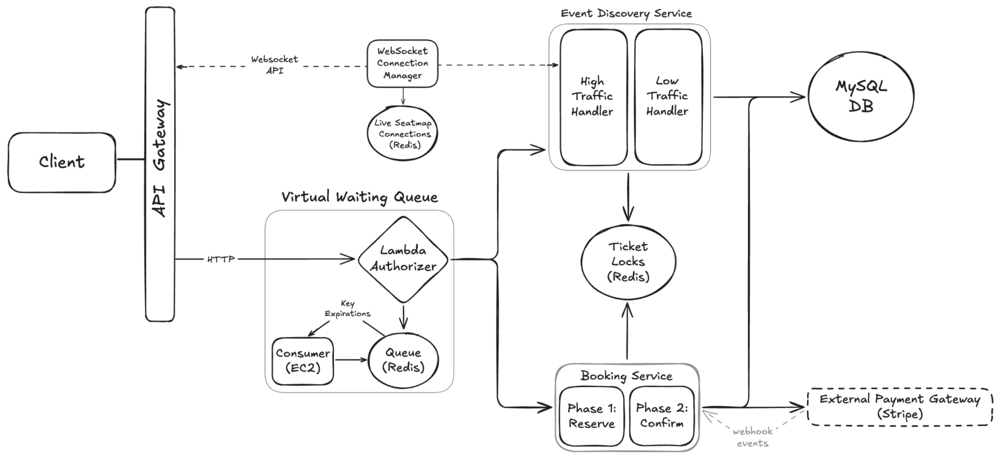

# 📺 Ticketmaster – Section 7

In this section, we refactor the Event Discovery Service to distinguish between low-traffic and high-traffic handlers.
The low-traffic handler continues to serve a static seat map as before.
For high-traffic events, users access a **Live-Updating Seat Map** powered by **WebSocket API Gateway**, enabling real-time seat availability updates without requiring page refreshes.

- **Part 1 — Build the WebSocket Connection Manager**:  
  We create and deploy a Lambda-powered WebSocket connection manager that tracks connected users in Redis, enabling future real-time seat map broadcasts.

- **Part 2 — Build High Traffic Handler & Test the Live Seat Map**:  
  We create the dedicated high-traffic event handler, deploy it to AWS, and test the complete browser flow from waiting room admission to a live-updating seat map experience.

<div align="center">
    
</div>

## 🎥 Video Walkthrough

### 🔹 Part 1: Build the WebSocket Connection Manager

**Title:** Ticketmaster – Section 7 (Part 1)  
**Link:** [Watch on Udemy](https://www.udemy.com/course/practical-system-design/learn/lecture/55998785#overview)

### 🔹 Part 2: Build High Traffic Handler & Test the Live Seat Map

**Title:** Ticketmaster – Section 7 (Part 2)  
**Link:** [Watch on Udemy](https://www.udemy.com/course/practical-system-design/learn/lecture/55998787#overview)

# ⚙️ Instructions and Commands

## ✏️ Part 1 – Build the WebSocket Connection Manager

From project root `~Desktop/ticketmaster_demo`:

### 1. Create the Websocket Connection Manager

Create a new folder for the websocket connection manager:

```bash
mkdir websocket_connection_manager
```

Create the Lambda handler file inside the directory:

```bash
touch websocket_connection_manager/lambda_function.py
```

-  On **Windows PowerShell**:
  ```bash
  New-Item websocket_connection_manager/lambda_function.py
  ```

> _Paste in the provided starter code for the Lambda function._

### 2. Package Websocket Connection Manager for Deployment

Navigate into the `websocket_connection_manager` directory:

```bash
cd websocket_connection_manager
```

Install dependencies into the local directory:

```bash
pip install redis -t .
```

Create the deployment package:

```bash
zip -r lambda_function.zip .
```

-  On **Windows PowerShell**:
  ```bash
  tar -a -c -f lambda_function.zip *
  ```

<br>

## ✏️ Part 2 – Build High Traffic Handler & Test the Live Seat Map

### 1. Return to Project Root

If you are currently in the `websocket_connection_manager` directory, navigate back to the project root (`~/Desktop/ticketmaster_demo`):

```bash
cd ..
```

### 2. Create the High Traffic Handler

Create a new folder for the high traffic handler:

```bash
mkdir high_traffic_handler
```

Create the Lambda handler file inside the directory:

```bash
touch high_traffic_handler/lambda_function.py
```

-  On **Windows PowerShell**:
  ```bash
  New-Item high_traffic_handler/lambda_function.py
  ```

> _Paste in the provided starter code for the Lambda function._

### 3. Package High Traffic Handler for Deployment

Navigate into the `high_traffic_handler` directory:

```bash
cd high_traffic_handler
```

Install dependencies into the local directory:

```bash
pip install pymysql redis -t .
```

Create the deployment package:

```bash
zip -r lambda_function.zip .
```

-  On **Windows PowerShell**:
  ```bash
  tar -a -c -f lambda_function.zip *
  ```

### 4. Test High Traffic Handler Flow in the Browser

Connect to Redis:

```bash
redis-cli -u $TICKETMASTER_REDIS_URL
```

-  On **Windows PowerShell**:
  ```bash
  docker run -it --rm redis redis-cli -u $TICKETMASTER_REDIS_URL
  ```

After entering the waiting room for a high-traffic event in the browser, inspect the current state in the Redis CLI:

- List all keys
  ```bash
  keys *
  ```
- Shorten the waiting TTL to accelerate queue processing
  ```bash
  EXPIRE waiting:1H:admin_user 5
  ```
- After the waiting TTL expires, verify updated state
  ```bash
  keys *
  ```

Once you are redirected to the high traffic event page, inspect the state again in the Redis CLI:

- List all keys
  ```bash
  keys *
  ```
- Inspect active WebSocket connections
  ```bash
  SMEMBERS live_seatmap_connections
  ```

After closing the Ticketmaster browser window, verify and clean up state in the Redis CLI:

- List all keys
  ```bash
  keys *
  ```
- Reset state
  ```bash
  DEL allowed:1H:admin_user
  ```

<br>
