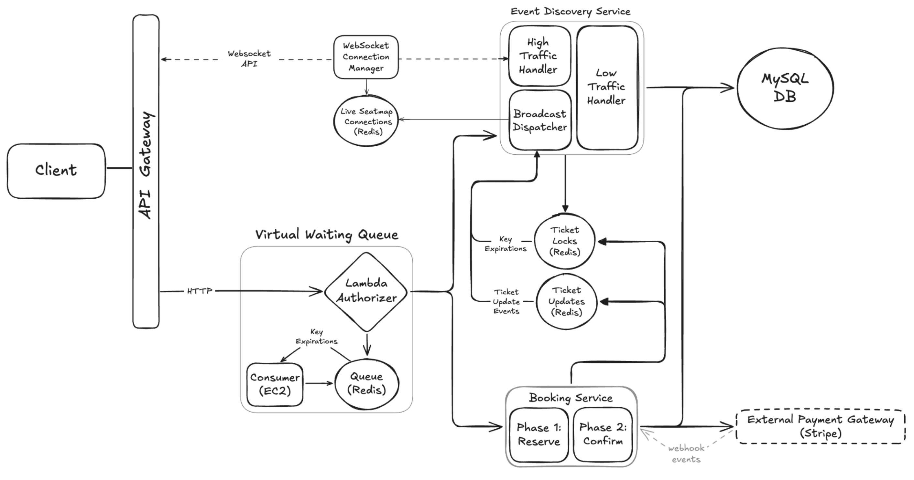

# 📺 Ticketmaster – Section 8

In this section, we’ll complete the live seat map architecture by implementing a **Broadcast Dispatcher** that pushes real-time seat availability updates to connected users.
This allows all connected clients to see seat availability refresh in real time — without page reloads or polling.

- **Part 1 — Build the Broadcast Dispatcher**:  
  We create the background dispatcher script that listens for seat reservation changes and publishes live updates to all active seat map viewers.

- **Part 2 — Deploy & Test Real-Time Seat Map Updates**:  
  We launch the Broadcast Dispatcher on EC2 using User Data, then test the full browser flow to confirm seat reservations and expirations instantly update every connected high-traffic seat map.

<div align="center">
    
</div>

## 🎥 Video Walkthrough

### 🔹 Part 1: Build the Broadcast Dispatcher

**Title:** Ticketmaster – Section 8 (Part 1)  
**Link:** [Watch on Udemy](https://www.udemy.com/course/practical-system-design/learn/lecture/55998789#overview)

### 🔹 Part 2: Deploy & Test Real-Time Seat Map Updates

**Title:** Ticketmaster – Section 8 (Part 2)  
**Link:** [Watch on Udemy](https://www.udemy.com/course/practical-system-design/learn/lecture/55998793#overview)

# ⚙️ Instructions and Commands

## ✏️ Part 1 – Build the Broadcast Dispatcher

From project root `~Desktop/ticketmaster_demo`:

### 1. Create Broadcast Dispatcher Script

```bash
touch high_traffic_handler/broadcast_dispatcher.py
```

-  On **Windows PowerShell**:
  ```bash
  New-Item high_traffic_handler/broadcast_dispatcher.py
  ```

> _Paste in the provided starter code for the `broadcast_dispatcher` script._

<br>

## ✏️ Part 2 – Deploy & Test Real-Time Seat Map Updates

### 1. Configure EC2 User Data for `broadcast_dispatcher`

Paste the following script into the **User Data** section:

> ⚠️ **Important**  
> Replace the placeholder below with your actual `broadcast_dispatcher.py` implementation:
>
> ```python
> # <PASTE YOUR broadcast_dispatcher.py CODE HERE>
> ```

```bash
#!/bin/bash
set -euxo pipefail
APP_DIR="/home/ubuntu"
VENV_DIR="$APP_DIR/venv"
SCRIPT="$APP_DIR/broadcast_dispatcher.py"
sudo apt update
sudo apt install -y python3-venv
chown -R ubuntu:ubuntu "$APP_DIR"
cd "$APP_DIR"
python3 -m venv venv
"$VENV_DIR/bin/pip" install --upgrade pip
"$VENV_DIR/bin/pip" install redis boto3

cat <<'EOF' > "$SCRIPT"
############################################################
# <PASTE YOUR broadcast_dispatcher.py CODE HERE>
############################################################
EOF

chmod +x "$SCRIPT"
chown ubuntu:ubuntu "$SCRIPT"
cat <<EOF > /etc/systemd/system/broadcast-dispatcher.service
[Unit]
Description=Ticketmaster Seatmap Broadcast Dispatcher
After=network-online.target
Wants=network-online.target
[Service]
Type=simple
User=ubuntu
WorkingDirectory=$APP_DIR
Environment=PYTHONUNBUFFERED=1
ExecStart=$VENV_DIR/bin/python $SCRIPT
Restart=always
RestartSec=5
StandardOutput=append:/var/log/broadcast_dispatcher.log
StandardError=append:/var/log/broadcast_dispatcher.log
[Install]
WantedBy=multi-user.target
EOF
systemctl daemon-reload
systemctl enable broadcast-dispatcher
systemctl start broadcast-dispatcher
```

### 2. Test High Traffic Handler Flow in the Browser

Connect to Redis:

```bash
redis-cli -u $TICKETMASTER_REDIS_URL
```

-  On **Windows PowerShell**:
  ```bash
  docker run -it --rm redis redis-cli -u $TICKETMASTER_REDIS_URL
  ```

After entering the waiting room for a high-traffic event in the browser, inspect the current state in the Redis CLI:

- List all keys
  ```bash
  keys *
  ```
- Shorten the waiting TTL to accelerate queue processing
  ```bash
  EXPIRE waiting:1H:admin_user 5
  ```

After reserving ticket `1:1H` in the browser, inspect the updated state in the Redis CLI:

- List all keys
  ```bash
  keys *
  ```
- Shorten the reservation lock to simulate expiration
  ```bash
  EXPIRE reserved:1:1H_99.99 5
  ```

After closing the Ticketmaster browser window, clean up and exit the Redis CLI:

- Reset state
  ```bash
  DEL allowed:1H:admin_user
  ```
- Exit the Redis CLI
  ```bash
  Ctrl + C
  ```

### 3. Database Verification & Reset

Use a temporary MySQL client container to connect to your database:

```bash
docker run --rm -it \
  -e MYSQL_PWD='Password100!' \
  mysql:8.0 \
  mysql -h $TICKETMASTER_DB_URL -u admin
```

-  On **Windows PowerShell**:
  ```bash
  docker run --rm -it `
    -e MYSQL_PWD='Password100!' `
    mysql:8.0 `
    mysql -h $TICKETMASTER_DB_URL -u admin
  ```

Once connected, switch to the `ticketmaster_db` database:

```bash
USE ticketmaster_db;
```

Verify the current state of all tickets:

```sql
SELECT * FROM Tickets;
```

> You should see the ticket `1:1H` marked as booked after a successful confirmation.

Reset ticket to unbooked state:

```sql
UPDATE Tickets SET userId = NULL, isBooked = 0 WHERE ticketId = '1:1H';
```

<br>
