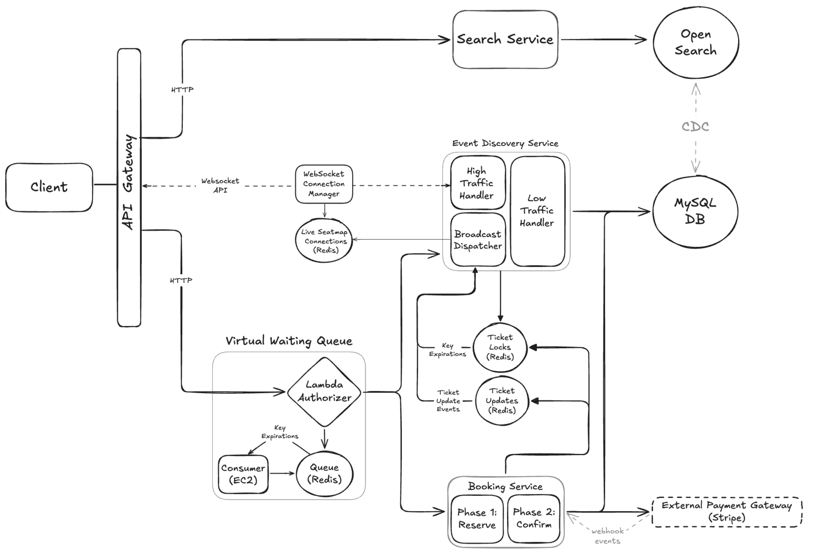

# 📺 Ticketmaster – Section 9

In this section, we build a **Search Service** using **Amazon OpenSearch** to power event and ticket discovery. We'll set up a lightweight OpenSearch domain, define a custom index, seed it with sample documents, and deploy a Lambda-based search endpoint to query it directly.

<div align="center">
    
</div>

## 🎥 Video Walkthrough

**Title:** Ticketmaster – Section 9  
**Link:** [Watch on Udemy](https://www.udemy.com/course/practical-system-design/learn/lecture/55998795#overview)

# ⚙️ Instructions and Commands

### 1. Configure OpenSearch Index Mapping

In the OpenSearch Dashboard, navigate to the **Index Mapping (JSON editor)** for your index and paste the following configuration:

```bash
{
  "properties": {
    "eventId": { "type": "text" },
    "name": { "type": "text" },
    "description": { "type": "text" },
    "date": {
      "type": "date",
      "format": "yyyy-MM-dd HH:mm:ss"
    }
  }
}
```

### 2. Seed OpenSearch Index with Documents

In the OpenSearch Dashboard, open **Dev Tools** and run the following request to seed documents into the `ticketmaster_index`:

```bash
POST _bulk
{ "index": { "_index": "ticketmaster_index", "_id": "1" } }
{ "eventId": "1H", "name": "Taylor Swift Concert", "description": "An electrifying concert featuring Taylor Swift.", "date": "2030-03-15 19:00:00" }
{ "index": { "_index": "ticketmaster_index", "_id": "2" } }
{ "eventId": "2L", "name": "Classical Music Concert", "description": "A soothing evening of classical music.", "date": "2030-04-20 18:30:00" }
{ "index": { "_index": "ticketmaster_index", "_id": "3" } }
{ "eventId": "3L", "name": "Stand-up Comedy", "description": "An evening of laughs with top comedians.", "date": "2030-05-10 20:00:00" }
```

### 3. Configure Environment Variables

After adding `OPENSEARCH_URL` to your environment file, reload the variables into your current shell session:

```bash
source .ticketmaster_env
```

-  On **Windows PowerShell**:
  ```bash
  . .\.ticketmaster_env.ps1
  ```

### 4. OpenSearch Queries

Run a query to retrieve all documents from the `ticketmaster_index`:

```bash
curl -u 'admin:Password100!' -X GET \
  -H "Content-Type: application/json" \
  $OPENSEARCH_URL/ticketmaster_index/_search \
  -d '{
    "query": {
      "match_all": {}
    }
  }'
```

-  On **Windows PowerShell**:
  ```bash
  curl.exe -u "admin:Password100!" -X GET `
    -H "Content-Type: application/json" `
    "${OPENSEARCH_URL}/ticketmaster_index/_search" `
    -d '{
      \"query\": {
        \"match_all\": {}
      }
    }'
  ```

Run a match phrase query to search for events where the `name` field contains `"concert"`:

```bash
curl -u 'admin:Password100!' -X GET \
  -H "Content-Type: application/json" \
  $OPENSEARCH_URL/ticketmaster_index/_search \
  -d '{
    "query": {
      "match_phrase": {
        "name": "concert"
      }
    }
  }'
```

-  On **Windows PowerShell**:
  ```bash
  curl.exe -u "admin:Password100!" -X GET `
    -H "Content-Type: application/json" `
    "${OPENSEARCH_URL}/ticketmaster_index/_search" `
    -d '{
      \"query\": {
        \"match_phrase\": {
          \"name\": \"concert\"
        }
      }
    }'
  ```

### 5. Create Search Service

Create a new folder for the service:

```bash
mkdir search_service
```

Create the Lambda handler file inside the directory:

```bash
touch search_service/lambda_function.py
```

-  On **Windows PowerShell**:
  ```bash
  New-Item search_service/lambda_function.py
  ```

> _Paste in the provided starter code for the Lambda function._

### 6. Virtual Environment Updates

Make sure your virtual environment is activated:

```bash
source ticketmaster_venv/bin/activate
```

-  On **Windows PowerShell**:
  ```bash
  .\ticketmaster_venv\Scripts\Activate.ps1
  ```

Install `opensearch-py` and `requests` into your virtual environment:

```bash
pip install opensearch-py requests
```

### 7. Run Search Service Locally

```bash
python search_service/lambda_function.py
```

### 8. Package Search Service for Deployment

Navigate into the `search_service` directory:

```bash
cd search_service
```

Install dependencies into the local directory:

```bash
pip install opensearch-py requests -t .
```

Create the deployment package:

```bash
zip -r lambda_function.zip .
```

-  On **Windows PowerShell**:
  ```bash
  Get-ChildItem -Force -Exclude lambda_function.zip |
    ForEach-Object { $_.Name } |
    tar -a -c -f lambda_function.zip -T -
  ```
  > _**Note:** We use this slightly more defensive version of the `tar` command because the `search_service` includes a larger set of dependencies. In some cases, the simpler wildcard version can fail on Windows when packaging larger dependency folders._

<br>
